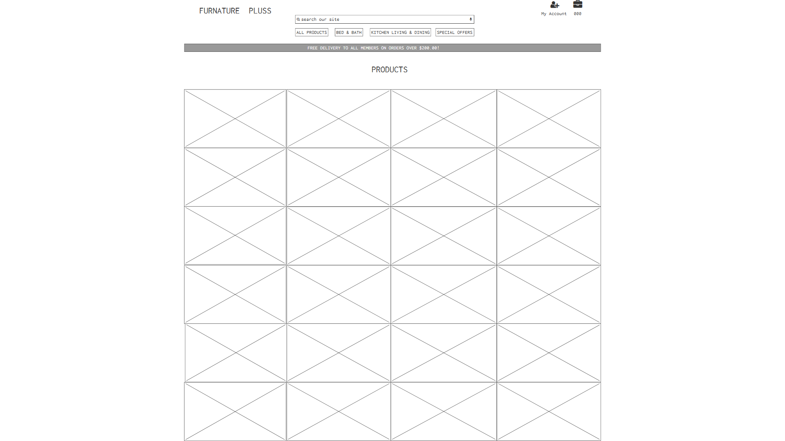
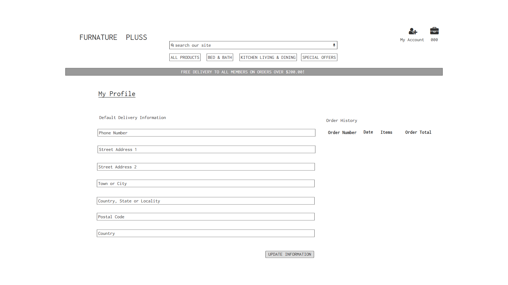

MileStone README.md

## **My Milestone 4 Project**

Welcome! [View live project here]()

Milestone Project Home Page

# **UX**
Furniture Plus is a  fictional e-commerce furniture store web application, built for Code Institute as a part of Full Stack Software Development Diploma course. Project was build with using semantic HTML5, CSS3, JavaScript (jQuery) along with Python framework Django 3.2.3. The site will encourage customers to purchase furniture and household items online. It's a user-friendly navigation system, accompanied by its visual image appeal, through product search and filter functionality, and full-featured authentication system including email confirmations and user profiles. A live fully functional payment system. Real-time notifications that guide the user's experience. With the potential to become a sustainable revenue-generating business.
## **Customer Goals**
- Easy access being able to pick up where you left off.
- Be provided with  a personalized experience.
- Easy navigation throughout the site, A strong feeling of being in control at all times through - their experience.
- Being able to edit or change their purchase at any point in time before checkout.
- Being able to search for specific products by name price or rating.
- Being legible for all specials advertised on site.
- Visual appeal products being displayed on full colour.
- The ability to be able to purchase whether registered member or guess.

## **Developer and Business Goals**
- Providing a unique customer experience.  
- Making responsive e-commerce website.
- Easy navigation throughout the site and easy adjustment of purchase before checkout.
- Security features to protect user information
- Increasing the number of loyal customers.
- Boosting the efficiency of services.
- Increasing sales.
- Grow email list / registered members. 
- Provide visitors a personalized experience. 
## **User Stories**

| As A User         |I Want To Be Able To...                                    | So That I Can... 
| ----------------- |:--------------------------------------------------------- |:---------------------------------------------------------------------- |
|&nbsp;             |**Nevigation**                                             |&nbsp;                                                                  |
|Shopper          |View a list of products                                    |Select something to purchase                                            |
|Shopper          |View individual product details                            |Identify the price, description, product rating and product image       |
|Shopper          |Quickly identify deals, clearance items and special offers |Take advantage of special savings on products I'd like to purchase      |
|Shopper          |Easily view total of my purchases at any time              |Avoid spending too much                                                 |
|&nbsp;             |**Registration and User Accounts**                         |&nbsp;                                                                  |
|Site User        |Easy register for an account                               |Have a personal account and be able to view my profile                  |
|Site User        |Easy login or logout                                       |Access to personal account information                                  |
|Site User        |Easily recover of my password in case I forgot it          |Recover access to my account                                            |
|Site User        |Receive an email confirmation after registering            |Verify that my account registration was successful                      |
|&nbsp;             |&nbsp;                                                     |View my personal order history and order confirmations and save my      |
|Site User        |Have a personalized user profile                           |my payment infor                                                        |
|&nbsp;             |**Sorting and Searching**                                  |&nbsp;                                                                  |
|Shopper         |Sort the list of available products                        |Easily identify best rated, best priced and category sorted products    |
|&nbsp;             |&nbsp;                                                     |Find the best-priced or best-rated product in a specific category, or   |
|Shopper         |Sort a specific category of product                        |sort the product in that category by name                               |
|&nbsp;             |&nbsp;                                                     |Find the best-priced or best-rated products accross broad categories,   |
|Shopper         |Sort multiple categories of products simuultaneousy        |such as "bed", "bath", "kitchen", "Living" or "dining"                  |
|Shopper         |Search for a product by name or discreption                |Find a specific product I'd like to purchase                            |
|Shopper         |Easily see what I've searched for and number of results    |Quickly decide whether the product I want is available                  |
|&nbsp;             |**Purchasing and Checkout**                                |&nbsp;                                                                  |
|Shopper         |Easily select the quantity of a product when purchasing it |Ensure I dont accidentally select the wrong product or quantity         |
|Shopper         |View items in my bag to be purchased                       |Identify the total cost of my purchase and all items I will receive     |
|Shopper         |Adjust the quantity of individual items in my bag          |Easily make changes to my purchase before checkout                      |
|Shopper         |Easily enter my payment information                        |Check out quickly and with no hassles                                   |
|Shopper         |Feel my personal and payment information is safe and secure|Confidently provide the needed information to make a purchase           |
|Shopper         |View an order confirnation after checkout                  |Verify that i haven't made any mistakes                                 |
|Shopper         |Receive an email confirmation after checking out           |Keep the confirmation of what I've purchased for my records             |
|&nbsp;             |**Admin and Store Management**                             |&nbsp;                                                                  |
|Store Owner     |Add a product                                              |Add new items to the store                                              |
|Store Owner     |Edit/update a product                                      |Change productprices, discription,images, and other product criteria    |
|Store Ownwe     |Delete a product                                           |Remove items that are no longer for sale                                |
 
## **Colours**
- A blue theme was chosen as it represents sea and the sky giving a sort of relaxing feeling as you reveal through the various products that available.

## **Styling**
- Company header to the left upper corner of page.
- The Lato font is being used as it gives off the clean business effect.
- Square edges on all buttons and form windows.
- The home page banner is displayed large at the center of the page accompanied by a shop button.
## **Wireframes, mockups, diagrams, etc**

#### Wireframe 1:
**Home Page** 

**All Products Page** 

**Sign Up/Register** 

**Sign In/Log in** 

**My Profile** 

**Shopping Bag** 

**Ceckout** 
### **Features:**
#### **Features presented across the project**
- **Navbar**, located at the top of the website page. Contains a search bar and seven links five of which are dropdowns which comprise other links.
    - The **_Furniture Plus_** logo links back to the home page when clicked.
    - The **_Search bar_** searches for the various products that the site has to offer.
    - The **_All Products_** link dropdown comprises links **by price** shoppers can view the price of all products in ascending order, **by Rating** shoppers can view all products by rating, **by categories**, shoppers can view all products by categories, and **all products** where the shopper can view all products on the site.
    - The **_Bed&Bath_** link dropdown comprises links **Bed** shoppers can view all products under the bad category and **bath** shoppers can view all products under the bath category, and **all bed&bath** shoppers can view all products under the categories of both bed&bath.
    - **_The Kitchen, Living Dining_** link dropdown comprises links **kitchen** shoppers can view all products under the kitchen category, **living** shoppers can view all products under the living categories, **dining** shoppers can view all products under the dining category, and **all kitchen, living and dining** shoppers can view all products under the categories of **kitchen, living, and dining**.
    - The **_Special Offers_** link dropdown comprises links **new arrivals** shoppers can view all products new to the store, **deals** shoppers can view all deals on products, **clearance** shoppers can view clearance on products, and **all Specials**, shoppers can view all products under the categories of, **new arrivals, deals**, and clearance that the store offers.
    - **_Shopping cart_** icon - links to the shopping cart. In the shopping cart the user can see a list of all purchases and can easily remove items. At the bottom of the shopping list there is a checkout button, when clicked:
        - if not logged in, the user will be presented with two choices: to login or to countinue the checkout process as a guest. If he/she chooses to continue as a guest, one where the user must type the shipping address and one for billing address. After that a page will be presented, where a payment card can be added and the user will be redirected to the **finalize checkout** page where there is a summary of all products from the **shopping cart**: the **shipping address**, the **billing address**, the **payment method**, the **cart total**, the **shipping fee** and the **order total** (the **order total** is the sum of the the **cart total + shipping fee**). Next to where the payment method is listed, there is a link where the user has the option to change the card. If clicked on **checkout** button, located at the bottom of the summary list, the payment will be processed and a message of thanks will be displayed and a confirmation email will be sent to user.
        - if logged in, the user will have to fill in the shipping address and the billing address then, will be redirected to the finalize checkout page where there is a summary of all products from the shopping cart: the shipping address, the billing address, the payment method, the cart total, the shipping fee and the order total (the order total is the sum of the cart total + shipping fee). Next to where the payment method is listed, there is a link where the user has the option to change the card. If clicked on checkout button, located at the bottom of the summary list, the payment will be processed and a message will be displayed.
    - **_Register_** - links to a page with a form where users can register by typing a unique username, an email address and a password which must be confirmed. At the bottom of the register form there is a link which links to the login page for users who already have an account.
    - **_Login_** - links to a page with a form where registered users can login by typing their username and password. At the bottom of the login form there is a link which links to the register page for users who do not have an account yet.

### **Existing Features**

### **Features Left to Implement**
 ### **Technologies Used:**
- [Gitpod](https://www.gitpod.io/) IDE - Used to build this project.
- [GitHub](https://github.com/) - Used as remote storage of my code online.
### **Front-End Technologies**
- [HTML5](https://en.wikipedia.org/wiki/HTML) - Used as the base for markup text.
- [CSS3](https://en.wikipedia.org/wiki/CSS) - Used as the base for cascading styles.
- [JQuery](https://code.jquery.com/jquery/) - Used as the primary JavaScript functionality.
- [Bootstrap](https://getbootstrap.com/) - Used as the front-end framework for layout and design.
- [Stripe AP](https://stripe.com/docs/api?lang=python) - Used to make secured payments.
- [Amazon AWS S3](https://aws.amazon.com/) - Used to store staticfiles and media folder and files.
### **Back-End Technologies**
- [Python](https://www.python.org/) - Used as the back-end programming language.
- [Django 3.2.3](https://www.djangoproject.com/) - Used as my Python web framework.
- [Heroku](https://heroku.com/) - Hosts the deployed version of this project.
- [PostgreSQL](https://www.postgresql.org/) - Used as relational SQL database plugin via Heroku.

### **Testing:**

#### User testing stories from User Experience Design (UX) Section
- 
#### Further Testing
-

#### Known Bugs and fixes
### **Deployment:**
- 
#### Deployment Process
 

### **Authors:**
- This project was created by Robert P Narcis an upcoming full-stack software developer.
### **Credits:**
- ### **Content:**
- ### **Media:**
- ### **Acknowledgements:**
-