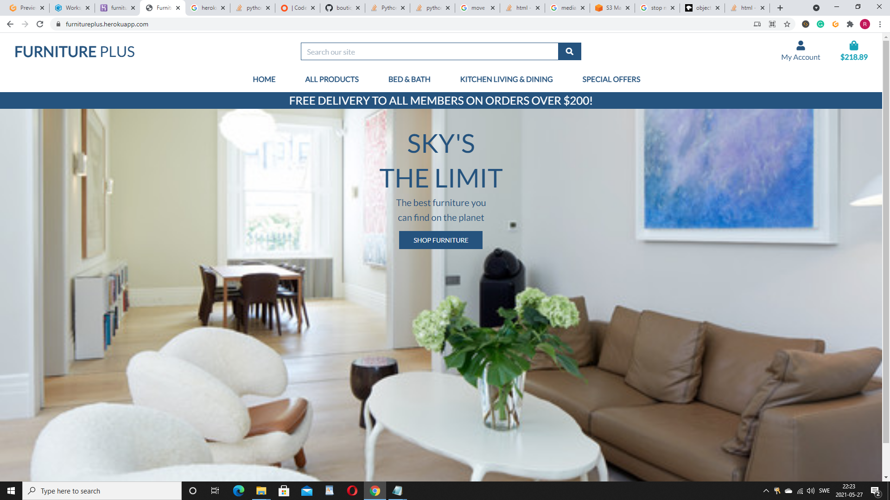

MileStone README.md

## **My Milestone 4 Project**
### **Furnitureplus - Ecommerce (full stack web application)**

Welcome! [View live project here](https://furnitureplus.herokuapp.com/)

Milestone Project Home Page

## **UX**
Furniture Plus is a  fictional e-commerce furniture store web application, built for Code Institute as a part of the Full Stack Software Development Diploma course. The Project was build using semantic HTML5, CSS3, JavaScript (jQuery) along with Python framework Django 3.2.3. The site will encourage customers to purchase furniture and household items online. It's a user-friendly navigation system, accompanied by its visual image appeal, through product search and filter functionality, and full-featured authentication system including email confirmations and user profiles. A live fully functional payment system. Real-time notifications that guide the user's experience. With the potential to become a sustainable revenue-generating business.
### **Customer Goals**
- Easy access being able to pick up where you left off.
- Be provided with a personalized experience.
- Easy navigation throughout the site, A strong feeling of being in control at all times through - their experience.
- Being able to edit or change their purchase at any point in time before checkout.
- Being able to search for specific products by name price or rating.
- Being legible for all specials advertised on site.
- Visual appeal products being displayed in full color.
- The ability to be able to purchase whether a registered member or guess.

### **Developer and Business Goals**
- Providing a unique customer experience.  
- Making responsive e-commerce website.
- Easy navigation throughout the site and easy adjustment of purchase before checkout.
- Security features to protect user information
- Increasing the number of loyal customers.
- Boosting the efficiency of services.
- Increasing sales.
- Grow email list / registered members. 
- Provide visitors a personalized experience. 
### **User Stories**

| As A User         |I Want To Be Able To...                                    | So That I Can... 
| ----------------- |:--------------------------------------------------------- |:---------------------------------------------------------------------- |
|&nbsp;             |**Navigation**                                             |&nbsp;                                                                  |
|Shopper          |View a list of products                                    |Select something to purchase                                            |
|Shopper          |View individual product details                            |Identify the price, description, product rating and product image       |
|Shopper          |Quickly identify deals, clearance items and special offers |Take advantage of special savings on products I'd like to purchase      |
|Shopper          |Easily view the total of my purchases at any time          |Avoid spending too much                                                 |
|&nbsp;             |**Registration and User Accounts**                       |&nbsp;                                                                  |
|Site User        |Easy register for an account                               |Have a personal account and be able to view my profile                  |
|Site User        |Easy login or logout                                       |Access to personal account information                                  |
|Site User        |Easily recover my password in case I forgot it             |Recover access to my account                                            |
|Site User        |Receive an email confirmation after registering            |Verify that my account registration was successful                      |
|&nbsp;             |&nbsp;                                                     |View my personal order history and order confirmations and save my      |
|Site User        |Have a personalized user profile                           |my payment info                                                        |
|&nbsp;             |**Sorting and Searching**                                  |&nbsp;                                                                  |
|Shopper         |Sort the list of available products                        |Easily identify best rated, best priced and category sorted products    |
|&nbsp;             |&nbsp;                                                     |Find the best-priced or best-rated product in a specific category, or   |
|Shopper         |Sort a specific category of product                        |sort the product in that category by name                               |
|&nbsp;             |&nbsp;                                                     |Find the best-priced or best-rated products across broad categories,   |
|Shopper         |Sort multiple categories of products simultaneously        |such as "bed", "bath", "kitchen", "Living" or "dining"                  |
|Shopper         |Search for a product by name or description                |Find a specific product I'd like to purchase                            |
|Shopper         |Easily see what I've searched for and number of results    |Quickly decide whether the product I want is available                  |
|&nbsp;             |**Purchasing and Checkout**                                |&nbsp;                                                                  |
|Shopper         |Easily select the quantity of a product when purchasing it |Ensure I don't accidentally select the wrong product or quantity         |
|Shopper         |View items in my bag to be purchased                       |Identify the total cost of my purchase and all items I will receive     |
|Shopper         |Adjust the number of individual items in my bag          |Easily make changes to my purchase before checkout                      |
|Shopper         |Easily enter my payment information                        |Check out quickly and with no hassles                                   |
|Shopper         |Feel my personal and payment information is safe and secure|Confidently provide the needed information to make a purchase           |
|Shopper         |View an order confirmation after checkout                  |Verify that I haven't made any mistakes                                 |
|Shopper         |Receive an email confirmation after checking out           |Keep the confirmation of what I've purchased for my records             |
|&nbsp;             |**Admin and Store Management**                             |&nbsp;                                                                  |
|Store Owner     |Add a product                                              |Add new items to the store                                              |
|Store Owner     |Edit/update a product                                      |Change product prices, description, images, and other product criteria    |
|Store Ownwe     |Delete a product                                           |Remove items that are no longer for sale                                |
 
### **Colours**
- A blue theme was chosen as it represents the sea and the sky giving a sort of relaxing feeling as you reveal through the various products that available.

### **Styling**
- Company header to the left upper corner of the page.
- The Lato font is being used as it gives off the clean business effect.
- Square edges on all buttons and form windows.
- The home page banner is displayed large at the center of the page accompanied by a shop button.
### **Wireframes, mockups, diagrams, etc**
View wireframes [**here**](https://github.com/rpaulnarcis/milestone4/tree/master/wireframes)
## **Features:**
- **Navbar**, located at the top of the website page. Contains a search bar and seven links five of which are dropdowns that comprise other links.
    - The **_Furniture Plus_** logo links back to the home page when clicked.
    - The **_Search bar_** searches for the various products that the site has to offer.
    - The **_All Products_** link dropdown comprises links **by price** shoppers can view the price of all products in ascending order, **by Rating** shoppers can view all products by rating, **by categories**, shoppers can view all products by categories, and **all products** where the shopper can view all products on the site.
    - The **_Bed&Bath_** link dropdown comprises links **Bed** shoppers can view all products under the bad category and **bath** shoppers can view all products under the bath category, and **all bed & bath** shoppers can view all products under the categories of both bed & bath.
    - **_The Kitchen, Living Dining_** link dropdown comprises links **kitchen** shoppers can view all products under the kitchen category, **living** shoppers can view all products under the living categories, **dining** shoppers can view all products under the dining category, and **all kitchen, living and dining** shoppers can view all products under the categories of **kitchen, living, and dining**.
    - The **_Special Offers_** link dropdown comprises links **new arrivals** shoppers can view all products new to the store, **deals** shoppers can view all deals on products, **clearance** shoppers can view clearance on products, and **all Specials**, shoppers can view all products under the categories of, **new arrivals, deals**, and clearance that the store offers.
    - **_Shopping cart_** icon - links to the shopping cart. In the shopping cart the, user can see a list of all purchases and can easily remove items. At the bottom of the shopping list there is a checkout button when clicked:
        - if not logged in, the user will be presented with two choices: to login or continue the checkout process as a guest. If he/she chooses to continue as a guest, one where the user must type the shipping address and one for the billing address. After that a page will be presented, where a payment card can be added and the user will be redirected to the **finalize checkout** page where there is a summary of all products from the **shopping cart**: the **shipping address**, the **billing address**, the **payment method**, the **cart total**, the **shipping fee** and the **order total** (the **order total** is the sum of the **cart total + shipping fee**). Next to where the payment method is listed, there is a link where the user has the option to change the card. If clicked on **checkout** button, located at the bottom of the summary list, the payment will be processed and a message of thanks will be displayed and a confirmation email will be sent to the user.
        - if logged in, the user will have to fill in the shipping address and the billing address, will be redirected to the finalize checkout page where there is a summary of all products from the shopping cart: the shipping address, the billing address, the payment method, the cart total, the shipping fee and the order total (the order total is the sum of the cart total + shipping fee). Next to where the payment method is listed, there is a link where the user has the option to change the card. If clicked on the checkout button, located at the bottom of the summary list, the payment will be processed and a message will be displayed.
    - **_Register_** - links to a page with a form where users can register by typing a unique username, an email address, and a password that must be confirmed. At the bottom of the register form there is a link which links to the login page for users who already have an account.
    - **_Login_** - links to a page with a form where registered users can login by inputting their username and password. At the bottom of the login form, there is a link to the registration page for users who do not have an account as yet.
### **Features Left to Implement**
- Allauth logging in, and sign up with social accounts.
- Product stock inventory system.
### **Technologies Used:**
- [Gitpod](https://www.gitpod.io/) IDE - Used to build this project.
- [GitHub](https://github.com/) - Used as remote storage of my code online.
### **Front-End Technologies**
- [HTML5](https://en.wikipedia.org/wiki/HTML) - Used as the base for markup text.
- [CSS3](https://en.wikipedia.org/wiki/CSS) - Used as the base for cascading styles.
- [JQuery](https://code.jquery.com/jquery/) - Used as the primary JavaScript functionality.
- [Bootstrap](https://getbootstrap.com/) - Used as the front-end framework for layout and design.
- [Stripe AP](https://stripe.com/docs/api?lang=python) - Used to make secured payments.
- [Amazon AWS S3](https://aws.amazon.com/) - Used to store staticfiles and media folder and files.
### **Back-End Technologies**
- [Python](https://www.python.org/) - Used as the back-end programming language.
- [Django 3.2.3](https://www.djangoproject.com/) - Used as my Python web framework.
- [Heroku](https://heroku.com/) - Hosts the deployed version of this project.
- [PostgreSQL](https://www.postgresql.org/) - Used as relational SQL database plugin via Heroku.

## **Testing:**
All pages have been tested on all screen sizes. This has been done via Google Chrome developer tools and by testing on my phone and iPad. Also, all features of the page are scaling as intended in tablet and mobile devices.

I checked the registration form to see if an error occurred when entering an existing username or email, and the form validations react as expected. Also, if the confirmation password does not match the password, it will cause an error. I made sure that the login form will cause an error if the username and password entered are not registered in the database. For registration user name must be four characters or more or it will throw an error message, if the password is too similar to the email address it will throw an error message, the password also needs to contain at least eight characters. A verification email is sent on completion of the registration process.

I also checked to see if the number next to the cart is updated when a product is added or removed. Toast error, info, success, and warning pop messages are displayed every step of the way during the various processes. While testing the checkout process, I made sure that a new customer who does not have a payment card attached to his account will have to add a card to complete the checkout process. The change card functionality on the finalize checkout page has been tested with different cards to make sure it is working correctly and redirects back as intended. The Stripe payment function has been verified and all transactions show up on the Stripe dashboard. Both registered and guest users are allowed to purchase products on the site. All links and forms are verified to be working correctly via manual testing. Upon product purchases, a success message is displayed to the top right of the page from the bag, along with an order confirmation email being sent to the shopper, and order information is listed.
### **User testing stories from User Experience Design (UX) Section**
- A list of products is displayed by clicking on **all products**, or the various **product category tabs**.
- Product details, such as price, description, and rating can be viewed by clicking on the **product image**.
- Deals, clearance items, and special offers can be accessed by clicking the **special offers** tab.
- Toal of purchases is displayed under the **shopping bag icon** to the top right of the page.
- You register by clicking on the **account icon** and choosing **register**. Once your information is filled out and you are registered and logged in you can click on the **account icon** and choose **my profile** to view your profile.
- Login and logout options can be accessed by clicking the accounts icon.
- At the bottom of the sign-in form there is a **forgot password** option when clicked sends an email to the user giving them a chance to reset their password.
- After registering an email confirmation is sent to the user to confirm their email account.
- All users have a personalized user profile with a list of all payment information this can be accessed by clicking on the **accounts icon** and choosing **my profile**.
- To sort a list of available products one can click on the various tabs **all products**, **bed & bath**, **kitchen living & dining** as well as **special offers**.
- A specific category of products can be accessed by clicking on the various product tabs in the navbar.
-  To sort multiple categories of products simultaneously click on the **all products tab** and choose **by category**.
- You can search for a product by name or description by using the search bar at the top of the page.
- when searched for all available products are displayed under that particular search category.
- when purchasing a product there is a quantity tab with plus and minus tabs where you can adjust the quantity of the item that you will like to purchase.
- Items to be purchased can be viewed in your shopping bag by clicking on the bag icon.
- The number of items in the shopping bag can be adjusted with the quantity tab plus and minus in the shopping bag.
- Payment information can be easily entered by clicking the secure checkout button.
- Payment information is safe and secure via stripe security features, and other security features to place on the site.
- An order confirmation list is available at checkout.
- An email confirmation is sent to the customer after checkout.
- Store owners can add new products, and remove items that are no longer for sale, change product prices, description, images, and other product criteria, through the **product management** or the **admin account**.
### **Validators**
#### **HTML**
- Passing the HTML code from all templates into the [W3C Markup Validator](https://validator.w3.org/) generates numerous errors, but these are expected as the validator is unable to understand the Django template tags.
#### **CSS**
- The CSS code passes [W3C CSS Validation](https://jigsaw.w3.org/css-validator/) Service with two unknown errors.

#### **JavaScript**
- The JavaScript code passes trough [JSHint](https://jshint.com/) without errors.

The project was tested to ensure full usability across the following browsers:

- Google Chrome

- Mozilla Firefox

- Microsoft Edge
### **Known Bugs and fixes**

Problems experienced during deployment this was remedied by recreating the **AWS** bucket

Both the register and the login form pages on mobile were moving from left to right this was fixed by adding media queries for both mobile and tablet and adding CSS   body, html {overflow-x: hidden !important};
### **Deployment:**
This project is deployed on heroku: https://furnitureplus.herokuapp.com/

Because Heroku cannot host static files, during development, they were pushed to Amazon AWS in a S3-Bucket.

**Local Deployment**

Before you can deploy and run this application locally, you must have the following installed on your system:

- [Python 3](https://www.python.org/downloads/) - to run the application.
- [PIP](https://pip.pypa.io/en/stable/installing/) - to install all app requirements.
- An IDE of your choice.
- [GIT](https://www.atlassian.com/git/tutorials/install-git) - for cloning and version control.
- Next, perform the following steps:

- Sign up or log in to Heroku account using the heroku website, click new create new app, giving it a name and, choose the region closest to you. then on the resources tab, provision a new Postgress database, choose a free plan.

- To use Postgress we need to go back to gitpod and install dj-database_url and psycopg2, using pip3 install dj-database_url, and pip3 install psycopg2-binary now freeze the requirements with pip3 freeze requirements.txt, to make sure heroku installs all our apps requirements when we deploy it.

- Next, go to settings.py and at the top import dj-database_url, then down in the database settings comment out the default configuration, and replace the default database with a call to dj-database_url.parse, and give it the database url from heroku which you can get from your config variables in your app settings tab, or from the command line by typing heroku config, save your progress now we are ready to connect to heroku.

- Because we are connecting to Postgress for the first time we need to run migrations, by typing Python3 manage.py migrate. Import product data by using fixtures by loading the categories first then products, to load categories type python3 manage.py loaddata categories and then the same for products.

- At this point you will need to create a super user by typing python3 manage.py create a superuser, choose a name input email, and choose a create a password verify the password. The heroku app and database are now ready. Before committing remove the Heroku database config so that it doesn't end up in version control, uncomment the original database.

- Let's use an if statement in settings.py so that when our app is running on Heroku where the database URL environment variable will be defined.
We connect to Postgres and otherwise, we connect to sequel light.

- First, we need to install unicorn, which will act as our webserver, and freeze that into our requirements file. Now we can create our Procfile,
To tell Heroku to create a web dyno that will run unicorn and serve our django app.

- Next, we need to temporarily disable collectstatic by using Heroku config set, disable collectstatic equals 1 so that Heroku won't try to collect static files when we deploy.

- We'll need to add the hostname of our Heroku app to allowed hosts in settings.py, we can also add localhost in here so that gitpod will still work too.

We can now deploy our app, by adding and committing our changes pushing to github with git push, and then using git push Heroku master to deploy to Heroku.

- I'll go to my app in Heroku. And on the deploy tab set it to connect to github, search for my repository and then click connect, we can enable automatic deploys, and now every time we push to github, our code will automatically be deployed to Heroku as well.

- I'll set debug to be true only if there's a variable called development in the environment, and now I'll commit these changes and push them to github. Navigating to Heroku we can see there's a build-in progress, and our automatic deployments are working.

**You must create accounts with both Stripe and Amazon S3**.

- Sign up for a free Amazon AWS account to host your staticfiles and media files. From the S3 buckets section, you'll need to create a new unique bucket.

- After creating your AWS S3 Bucket, you should now be able to push the static files to AWS using this command: python manage.py collectstatic.

- Sign up for a free [Stripe](https://stripe.com/en-se?utm_campaign=paid_brand-SE_en_Search_Brand_Stripe-1436985502&utm_medium=cpc&utm_source=google&ad_content=301857629964&utm_term=kwd-295607662702&utm_matchtype=e&utm_adposition=&utm_device=c&gclid=CjwKCAjwzMeFBhBwEiwAzwS8zEPMOT3Ep4jOOFWC1x1NoXI4wZApqNqQNK7i2mygsnJ34i6_2F5k8RoC3esQAvD_BwE) account. Navigate to the **Developers** section, and click on **API Keys**. You should have two confidential keys, (**Publishable Key and Secret Key**) which need to be added to your .env file, as well as your Heroku config vars.

    - Create a .env file containing the following environmental variables:
    - STRIPE_PUB_KEY: Used to identify your account with Stripe;
    - STRIPE_SECRET_KEY: Standard secret key.
    - AWS_ACCESS_KEY_ID: AWS user credentials.
    - AWS_SECRET_ACCESS_KEY: AWS S3 credentials.
    - DATABASE_URL: Remote PostgreSQL database link if using a remote database.

**Your project should be completely set up and ready for remote deployment!**

**I haven't changed the remaining django errors because they are either migrations or auto-generated by Django**.
### **Credits:**
CodeInstitute Project Ado tutorial.
### **Media:**
The home page image was taken from [this](https://www.houzz.ie/photos/sitting-room-phvw-vp~15567651) website.
 
The product images were taken from [this](https://www.pinterest.com.au/search/pins/?rs=ac&len=2&q=furniture&eq=furn&etslf=7830&term_meta[]=furniture%7Cautocomplete%7C2) website.
### **Acknowledgements:**
- [Code Institute]() tutors.
- Stack Overflow.
